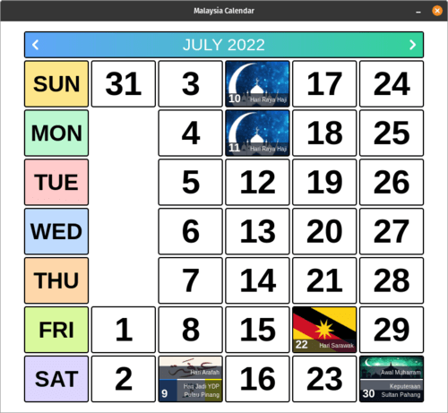

# kalendar-Malaysia
 a desktop application used as a calendar for Malaysian
 

---

## Stack
It is created using those amazing technologies:
- [React](https://reactjs.org/)
- [TypeScript](https://www.typescriptlang.org/)
- [Tailwind](https://tailwindcss.com/)
- [Tauri](https://tauri.studio/)
- And many others!

---

## License
>You can check out the full license [here](https://github.com/hafizhaziq307/kalendar-malaysia/blob/main/LICENSE)

This project is licensed under the terms of the **MIT** license.
